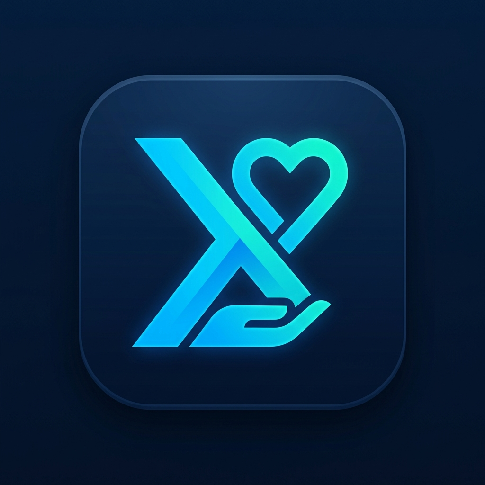

# XpertDonation

<p align="center">
  
</p>

<p align="center">
  <b>Gestion complète des médicaments donnés en pharmacie</b><br>
  Application Windows WPF pour le suivi des dons, stocks, et dispensations de médicaments.
</p>

<p align="center">
  
  
  
  
  
  
</p>

---

## Fonctionnalités

| Module | Touche | Description |
|--------|--------|-------------|
| **Accueil** | `F1` | Tableau de bord avec indicateurs de stock et alertes (lots expirés, péremptions ≤ 30/60/90 jours) |
| **Sortie** | `F2` | Dispensation par scan de code-barres, recherche de produits, panier, validation |
| **Stock** | `F3` | Inventaire complet avec filtres (périmé, non périmé, bloqué, etc.) et historique des lots |
| **Produits** | `F4` | Catalogue des produits avec CRUD complet et gestion des lots |
| **Entrée** | `F5` | Saisie de bons de donation avec autocomplete, impression d'étiquettes code-barres |
| **Journal** | `F6` | Journal des entrées (bons de donation validés) avec vue maître-détail |
| **Historique** | `F7` | Historique des dispensations avec filtres par date et code-barres |

### Points forts

- **Scan code-barres** — Scan des codes-barres de lots et produits pour une saisie rapide
- **Impression d'étiquettes** — Génération et impression d'étiquettes thermiques (CODE128, EAN-13, EAN-8)
- **Recherche multicritères** — Recherche par nom de produit, DCI, forme, code-barres système et fabricant
- **Synchronisation temps réel** — Mise à jour instantanée de tous les modules lors d'une modification de stock
- **Thème professionnel** — Interface moderne avec tableaux de bord, cartes KPI et codes couleurs (vert/orange/rouge) pour les alertes de péremption
- **Navigation clavier** — Navigation complète au clavier (F1-F7, touches de raccourci)

---

## Technologies

| Technologie | Version |
|-------------|---------|
| .NET (Windows) | 9.0 |
| WPF / MVVM | CommunityToolkit.Mvvm 8.2.2 |
| Entity Framework Core | 8.0.0 |
| SQL Server (LocalDB) | |
| ZXing.Net (code-barres) | 0.16.14 |
| Inno Setup (installateur) | 6 |

---

## Structure du projet

```
XpertDonation/
├── App.xaml                   # Point d'entrée, configuration DI, initialisation DB
├── appsettings.json           # Chaîne de connexion SQL Server
├── medicament.json            # Données initiales des médicaments
├── setup.iss                  # Script Inno Setup pour l'installateur
│
├── Controls/                  # Contrôles personnalisés
│   └── DateInputBox           # Saisie de date segmentée DD/MM/YYYY
│
├── Converters/                # Convertisseurs XAML (couleurs, visibilités, dates...)
├── Data/                      # Contexte EF Core et migrations
├── Helpers/                   # Services (code-barres, impression thermique...)
├── Models/                    # Entités métier (Drug, StockBatch, Dispensation...)
├── Resources/                 # Icône et logo de l'application
├── Themes/                    # Thème WPF complet (couleurs, styles, templates)
├── ViewModels/                # Tous les ViewModels MVVM
├── Views/                     # Toutes les fenêtres et contrôles XAML
└── installer/                 # Installateur pré-compilé (.exe)
```

---

## Installation

### Prérequis

- Windows 10/11 (64-bit)
- [.NET 9.0 Runtime](https://dotnet.microsoft.com/download/dotnet/9.0)
- [SQL Server LocalDB](https://learn.microsoft.com/sql/database-engine/configure-windows/sql-server-express-localdb) (installé avec Visual Studio ou via SQL Server Express)

### Via l'installateur

1. Téléchargez `XDonation_Setup.exe` depuis la [dernière release](https://github.com/AhmedAzzi/XpertDonation/releases)
2. Lancez l'installateur et suivez les instructions
3. La base de données et les données initiales sont créées automatiquement au premier lancement

### Depuis les sources

```bash
git clone https://github.com/AhmedAzzi/XpertDonation.git
cd XpertDonation
dotnet restore
dotnet run --project XpertPharm5Donation.csproj
```

---

## Captures d'écran

*(à venir)*

---

## Développement

### Construire l'installateur

```bash
# Publier l'application
dotnet publish XpertPharm5Donation.csproj -c Release -o publish

# Compiler l'installateur Inno Setup
iscc setup.iss
```

---

## Auteur

**Ahmed Azzi** — [mrahmedazzi@gmail.com](mailto:mrahmedazzi@gmail.com)

---

## Licence

Copyright © 2026 Ahmed Azzi. Tous droits réservés.
